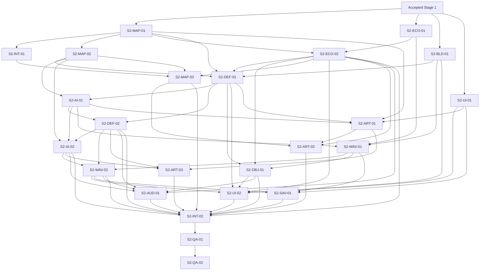

# Feature: Stage 2 First Playable / Vertical Slice

Status: Implementation active; S2-MAP-01, S2-INT-01 and S2-MAP-02 complete, 2026-09-22
Owner/workstream: Design coordination until the first implementation task is
claimed; Integration owns cross-system assembly
Depends on: accepted Stage 1 (`37178e2`), D-001–D-011,
`GRAYBOX_CORE_LOOP.md`, `DYNAMIC_ENEMY_PATHING.md`, `ART_DIRECTION.md`
Target: Unity `6000.6.2f1`, URP, Input System, Windows x64 Development Build

## Player And Project Outcome

Внешний игрок без объяснения разработчика проходит один законченный забег:
понимает, где трон и вход волны, добывает дерево, камень и металл на плоской
масштабируемой карте, выбирает башни трёх ролей, формирует ими маршрут нескольких
волн и достигает победы либо поражения. Команда получает проверенные размер
карты, travel time, performance budget, data contracts и representative
art/audio/UI bar, достаточные для решения о переходе к Stage 3.

Stage 2 не обещает весь MVP budget. Точные роли врагов, значения баланса, число
волн, длительность подготовки, правила восстановления ресурсов, строительство
во время волны, save policy и UI stack становятся обязательными только после
соответствующего decision task ниже.

## Ownership And Change Control

- **Integration owner — единственный владелец Stage 2 scene.** Только он создаёт,
  открывает dirty, редактирует, сохраняет и меняет build wiring для
  `Assets/Scenes/Stage2VerticalSlice.unity`. Остальные workstreams передают
  runtime code, data assets, prefabs, media, tests и точные wiring instructions,
  но не редактируют эту сцену.
- `Assets/Scenes/Stage1Graybox.unity` и проверенные Stage 1 assets сохраняются как
  regression baseline. Миграция выполняется добавочно, без скрытого переписывания
  или удаления Stage 1 surface.
- Один активный owner на task и change surface. Пересекающиеся prefab/data
  изменения передаются через Handoff Register до следующего владельца.
- Task-specific feature spec создаётся только когда задача реально входит в
  работу. Этот план не разрешает заранее создавать пустые feature-файлы.
- Runtime tuning живёт в Unity data assets после реализации. Этот документ
  фиксирует intent, contracts и gates, но не дублирует числовой баланс.
- Новые global managers, service locators, event buses, DI, pooling или общий
  interface layer не входят в план без измеренной необходимости и отдельного
  решения.

## Shared Contract Boundaries

Имена ниже логические, а не требование создать одноимённые типы.

- **Map definition:** границы клеток, surface kind (green/gray), buildable и
  walkable masks, один entrance, throne cell, resource placement regions и
  camera bounds. Runtime consumers читают данные и не меняют authored map.
- **Occupancy/navigation:** Defense атомарно регистрирует/освобождает tower cell;
  Waves/AI получает deterministic path либо доступный destructible blocker;
  revision меняется один раз на occupancy change, а не на enemy/frame.
- **Economy:** подтверждённая добыча выдаёт `(resource kind, amount)`; inventory
  поддерживает wood/stone/metal, проверяет полную стоимость и списывает её только
  после успешного placement confirm.
- **Building/defense:** build catalog выдаёт выбранную роль, стоимость, footprint
  и presentation data; tower lifecycle выдаёт confirmed-built и destroyed
  facts, совместимые с objective и occupancy consumers.
- **Combat:** tower/enemy/throne используют узкий health/damage contract. Hero
  не имеет health, attack или aggro role.
- **Waves/run state:** data задаёт утверждённую последовательность preparation и
  waves; runtime выдаёт phase, wave index, remaining threat, final victory и
  throne-loss facts.
- **Objectives:** одновременно активна не более чем одна secondary objective;
  progress принимает только confirmed gather/build facts и выдаёт существующий
  resource reward строго один раз.
- **Presentation:** UI, VFX и audio наблюдают подтверждённые gameplay state/facts
  и не становятся владельцами economy, combat, navigation или run rules.

## Atomic Task Backlog

### S2-MAP-01 — Data-Driven 100x100 Map Candidate

- **Status/result:** Complete, 2026-09-21. `STAGE2_MAP.md` and the generated
  `Stage2Map100x100.asset` provide the validated read-only map contract and
  Integration wiring notes. S2-MAP-01 EditMode 12/12 and full EditMode 20/20
  pass; no scene, ProjectSettings or package file changed. P-008 remains open.
- **Player/project outcome:** игрок получает читаемую плоскую карту с серым
  invasion corridor, зелёной лесной территорией, входом сверху справа, троном у
  противоположного конца corridor и дальностными resource regions; проект
  перестаёт зависеть от hard-coded 21x17 bounds.
- **Owner/workstream:** Foundation / Map.
- **Dependencies:** D-003, D-009–D-011; Stage 1 `IsoGrid` и pathing contracts.
- **Разрешённая область изменений:** новый map runtime/data/tests под
  `Assets/Stage2/Map/` и активный map feature spec; без scene, UI, combat,
  economy behavior и package changes.
- **Входной контракт:** fixed 2:1 isometric grid, coplanar green/gray surfaces,
  one entrance/one throne, первый кандидат 100x100.
- **Выходной контракт:** валидируемое map definition предоставляет shared Map
  definition fields и rejected reasons для invalid authored data.
- **Observable acceptance criteria:** одна data asset описывает candidate map;
  bounds, surfaces, entrance, throne, resource regions и camera bounds можно
  изменить без правки кода; renderer/debug view однозначно различает corridor и
  green territory.
- **Обязательные tests/build checks:** EditMode validation для bounds, masks,
  entrance/throne и round-trip cell/world; compile без warnings/errors,
  attributable задаче; Windows build не обязателен до S2-INT-01.
- **Следующий handoff:** Map definition и wiring notes -> Integration для
  S2-INT-01, Navigation для S2-MAP-03 и Economy для S2-ECO-02.

### S2-INT-01 — Stage 2 Scene Shell

- **Status/result:** Complete, 2026-09-22. `Stage2VerticalSlice` explicitly binds
  the validated read-only map to debug rendering, non-combat WASD movement,
  cell-space player/camera bounds and entrance/throne markers. Integration
  PlayMode 9/9, Stage 1 PlayMode 4/4 and full EditMode 20/20 pass. Windows x64
  Development Build starts in Stage 2; Stage 1 remains enabled at index 1 and
  its restart passes regression. Binding points, build commands and QA evidence
  are recorded in `production/WORKSTREAMS.md`. This closes only the scene shell;
  Stage 2 and P-008 remain open.
- **Player/project outcome:** существует отдельная запускаемая Stage 2 scene,
  которая показывает authored 100x100 candidate и сохраняет Stage 1 baseline.
- **Owner/workstream:** Integration.
- **Dependencies:** S2-MAP-01.
- **Разрешённая область изменений:** `Assets/Scenes/Stage2VerticalSlice.unity`,
  Stage 2 composition/bootstrap assets и `ProjectSettings/EditorBuildSettings.asset`;
  нельзя переписывать Stage 1 scene или реализовывать system rules в scene glue.
- **Входной контракт:** validated map definition, existing player/camera/grid
  behavior и explicit serialized-reference policy.
- **Выходной контракт:** scene composition root предоставляет documented binding
  points системным prefabs/data, а build settings однозначно запускают Stage 2
  slice без потери доступности Stage 1 regression scene.
- **Observable acceptance criteria:** scene открывается и запускается, игрок
  остаётся в map bounds, камера не показывает неавторизованную область, surfaces,
  entrance и throne landmarks читаются; missing references дают явную ошибку.
- **Обязательные tests/build checks:** PlayMode scene-load/movement/camera smoke;
  Console без новых attributable errors; Windows x64 Development Build launch
  smoke.
- **Следующий handoff:** stable scene binding points -> все system owners;
  дальнейшие scene edits остаются только у Integration.

### S2-MAP-02 — Production-Scale Navigation And Occupancy

- **Status/result:** Complete, 2026-09-22. `Assets/Stage2/Navigation/` provides
  map-snapshot navigation, identity-checked occupancy, exact revisions/reset,
  deterministic shortest open paths and reachable blockers, one shared search
  per queried revision, immutable plans and profiler/counter diagnostics.
  Full EditMode 42/42 and PlayMode 20/20 pass (new Navigation 22/22 and 7/7).
  Fresh Editor and Play entry: 0 errors/0 warnings. The 100x100 candidate's
  measured open/zigzag routes have 89/385 steps; 64 consumers over 128 frames
  use one full search. Hardware, raw-sample method, timings, API and Integration
  wiring notes are in the Stage 2 section of `DYNAMIC_ENEMY_PATHING.md`.
  Protected surfaces and scenes are unchanged. Build qualification remains
  S2-QA-01; P-008 and the Stage 2 gate remain open.
- **Player/project outcome:** maze-building и blocker siege сохраняют Stage 1
  поведение на масштабируемой карте без заметных зависаний при изменении пути.
- **Owner/workstream:** Foundation / Waves-AI navigation.
- **Dependencies:** S2-MAP-01; Stage 1 dynamic pathing acceptance.
- **Разрешённая область изменений:** navigation/path search runtime, profiler
  markers и EditMode/PlayMode test prefabs under `Assets/Stage2/`; без Stage 2
  scene, tower combat rules или art.
- **Входной контракт:** read-only Map definition и atomic tower occupancy
  changes.
- **Выходной контракт:** deterministic path/blocker result, revision invalidation
  и measurable search/replan timings for the active map candidate.
- **Observable acceptance criteria:** open route, long zigzag, full block,
  blocker destruction and resume работают на candidate bounds; many enemies не
  запускают отдельный full search каждый frame.
- **Обязательные tests/build checks:** EditMode determinism/path/blocker/invalid
  cell regression; PlayMode mid-wave occupancy and siege resume; profiler capture
  with recorded hardware/build/map data; Windows build check at S2-QA-01.
- **Следующий handoff:** navigation prefab/API, measurements и limits -> Defense,
  Waves/AI и Integration.

### S2-MAP-03 — Map Scale And Travel-Time Decision (P-008)

- **Player/project outcome:** исследование даёт meaningful risk-of-distance без
  пустых переходов, а команда получает подтверждённый production map size.
- **Owner/workstream:** Platform/QA with Foundation and Design coordination.
- **Dependencies:** S2-INT-01, S2-MAP-02, S2-ECO-02; representative player speed
  and resource regions.
- **Разрешённая область изменений:** benchmark/playtest data, map data variants,
  active map spec, `production/DECISIONS.md` и canonical status docs; scene edits
  только через Integration. 200x200 создаётся лишь как comparison variant, если
  100x100 требует сравнения.
- **Входной контракт:** same gameplay/content assumptions and recorded hardware
  for all compared sizes.
- **Выходной контракт:** accepted P-008 entry с выбранным size и evidence:
  travel-time routes, path/replan timings, frame-time/memory observations и
  readability notes.
- **Observable acceptance criteria:** решение объясняет, почему 100x100 принят
  либо почему comparison 200x200 лучше; нет автоматического обещания larger map.
- **Обязательные tests/build checks:** repeatable travel routes; Development
  Build profiler captures for compared variants; navigation regression on the
  selected size; clean Console.
- **Следующий handoff:** accepted size/data -> Integration, Art/content and
  S2-QA-01; rejected variant исключается из дальнейшего content work.

### S2-ECO-01 — Resource Depletion Policy (P-003)

- **Player/project outcome:** игрок понимает, конечны ли nodes и может ли
  закончиться доступный ресурс; economy не приводит к неочевидному soft-lock.
- **Owner/workstream:** Economy with Design coordination.
- **Dependencies:** GAME_VISION risk-of-distance pillar; Stage 1 finite-node
  behavior.
- **Разрешённая область изменений:** active economy spec, focused prototype/data
  and tests, `production/DECISIONS.md`; без Stage 2 scene, final tuning, UI art or
  new currencies.
- **Входной контракт:** only wood/stone/metal; contextual axe/pickaxe; no tiers,
  durability, crafting or automation.
- **Выходной контракт:** accepted P-003 rule specifies depletion/recovery and
  restart semantics, including prevention or explicit handling of resource
  soft-lock.
- **Observable acceptance criteria:** tester can predict node behavior from one
  interaction cycle; policy works with a full run and does not add post-MVP
  systems.
- **Обязательные tests/build checks:** EditMode state-transition and invalid
  amount coverage; focused manual economy playtest; if runtime changes, relevant
  Stage 1 PlayMode regression and clean Console; build not required for a
  docs-only decision.
- **Следующий handoff:** accepted resource lifecycle -> S2-ECO-02 and S2-WAV-01.

### S2-ECO-02 — Three-Resource Gathering And Inventory

- **Player/project outcome:** игрок находит, различает и добывает wood, stone и
  metal; более редкие resources требуют более дальнего выхода от трона.
- **Owner/workstream:** Economy.
- **Dependencies:** S2-MAP-01, S2-ECO-01.
- **Разрешённая область изменений:** economy rules/runtime, resource data,
  gatherable prefabs and tests under `Assets/Stage2/Economy/`; no Stage 2 scene,
  tower behavior, HUD layout or unapproved progression.
- **Входной контракт:** Map resource regions и accepted node lifecycle.
- **Выходной контракт:** Economy contract supports three resource kinds, atomic
  add/full-cost spend, confirmed gather facts and reset; prefabs expose explicit
  placement/wiring requirements.
- **Observable acceptance criteria:** all three silhouettes/placeholders are
  distinguishable before color-only reading; correct contextual tool is shown;
  distance ordering follows authored regions; no resource is granted twice.
- **Обязательные tests/build checks:** EditMode inventory/metal/cost/node
  lifecycle/objective-fact tests; prefab validation; focused PlayMode gather and
  reset; clean Console; integrated build deferred to S2-INT-02.
- **Следующий handoff:** resource data/prefabs/events -> Defense, Objectives, UI,
  Art and Integration.

### S2-BLD-01 — Build Timing Decision (P-002)

- **Player/project outcome:** игрок получает последовательное правило, можно ли
  перестраивать лабиринт во время активной волны, включая feedback для denied
  action.
- **Owner/workstream:** Defense with Design coordination.
- **Dependencies:** Stage 1 mid-wave placement and dynamic-replan behavior.
- **Разрешённая область изменений:** active building spec, focused prototype and
  tests, `production/DECISIONS.md`; no Stage 2 scene, new tower role or final UI.
- **Входной контракт:** navigation безопасно принимает occupancy changes
  mid-wave; current Stage 1 behavior permits them.
- **Выходной контракт:** accepted P-002 rule defines allowed phases, confirm/
  cancel behavior and interaction with enemies occupying or approaching a cell.
- **Observable acceptance criteria:** player cannot create an ambiguous/invalid
  placement state; rule supports the maze-building pillar and has recorded
  playtest evidence.
- **Обязательные tests/build checks:** PlayMode next-cell/multiple-enemy,
  cancel/no-spend and phase-transition cases for the chosen rule; pathing
  regression; clean Console; Windows build not required until integration.
- **Следующий handoff:** accepted phase/placement contract -> S2-DEF-01, UI and
  Integration.

### S2-DEF-01 — Data-Driven Build Catalog And Role Selection

- **Player/project outcome:** игрок может сравнить и выбрать одну из трёх tower
  roles до placement, видя cost, affordability, footprint and valid/invalid
  state.
- **Owner/workstream:** Defense.
- **Dependencies:** S2-MAP-01, S2-ECO-02, S2-BLD-01, S2-MAP-02 occupancy API.
- **Разрешённая область изменений:** build/defense data, placement runtime,
  preview prefab and tests; no Stage 2 scene, final HUD, enemy roster or balance
  tables in Markdown.
- **Входной контракт:** three-resource inventory, map validation, accepted build
  phases and navigation occupancy.
- **Выходной контракт:** build catalog exposes exactly the approved three roles'
  ids, costs, footprint and presentation references; confirmed placement emits
  one built fact and one occupancy change after successful full-cost spend.
- **Observable acceptance criteria:** selection, cancel, unaffordable, occupied,
  forbidden and valid states are distinct; invalid/cancelled action spends
  nothing; full blockage remains allowed.
- **Обязательные tests/build checks:** EditMode catalog/cost/validation; PlayMode
  select-preview-confirm/cancel/no-spend and occupancy; prefab validation and
  clean Console.
- **Следующий handoff:** catalog, placement prefab and built facts -> S2-DEF-02,
  Objectives, UI, Art and Integration.

### S2-DEF-02 — Three Distinct Tower Roles

- **Player/project outcome:** fast single-target, slow area-damage and
  control/support towers create observably different choices while all remain
  physical maze blockers.
- **Owner/workstream:** Defense.
- **Dependencies:** S2-DEF-01, S2-AI-01; active tower feature brief must define
  the minimal control/support effect without inventing progression.
- **Разрешённая область изменений:** tower rules/data/prefabs, combat VFX hooks
  and tests; no Stage 2 scene, upgrade system, repair, separate wall type or
  final art replacement.
- **Входной контракт:** build catalog/occupancy, shared health/damage and enemy
  target query.
- **Выходной контракт:** each role supplies target policy, effect facts, health
  and tunable combat data; destruction unregisters occupancy exactly once.
- **Observable acceptance criteria:** a tester can distinguish each role from
  behavior and feedback, not only color/name; AoE affects only valid targets;
  control/support has bounded, inspectable behavior; siege can destroy all.
- **Обязательные tests/build checks:** EditMode target/effect/cooldown rules;
  PlayMode one scenario per role plus destruction/occupancy regression;
  performance sanity with representative counts; clean Console.
- **Следующий handoff:** role prefabs/data/facts -> Waves/AI, Objectives, Art,
  Audio, UI and Integration.

### S2-AI-01 — Enemy Roster Brief

- **Player/project outcome:** обычные враги и final elite/boss создают
  читаемую escalation, не нарушая maze-building и не превращая героя в цель.
- **Owner/workstream:** Waves/AI with Design coordination.
- **Dependencies:** GAME_VISION MVP ceiling, S2-MAP-02 and tower role intent.
- **Разрешённая область изменений:** one active enemy feature brief, focused
  prototypes/data and `production/DECISIONS.md` only when a durable rule is
  accepted; no Stage 2 scene or mass content creation.
- **Входной контракт:** maximum three normal types and one final elite/boss;
  grounded grid navigation, blocker siege, throne target, non-combat hero.
- **Выходной контракт:** approved compact roster describes each role through
  speed/health/siege/target interaction and required feedback, without fixing
  tuning in Markdown.
- **Observable acceptance criteria:** each selected role adds a distinct
  player decision against the three tower roles; no role bypasses the core maze
  unless a new explicit decision approves it.
- **Обязательные tests/build checks:** paper/data matchup review, focused
  graybox playtest against representative layouts, pathing regression; no build
  required if no runtime is changed.
- **Следующий handoff:** approved roster/data needs -> S2-AI-02, Waves, Art,
  Audio and UI.

### S2-AI-02 — Enemy Archetypes And Siege Integration

- **Player/project outcome:** approved enemy set moves, signals its role,
  attacks blockers when trapped and threatens the throne without targeting hero.
- **Owner/workstream:** Waves/AI.
- **Dependencies:** S2-AI-01, S2-MAP-02, S2-DEF-02 combat contracts.
- **Разрешённая область изменений:** enemy runtime/data/prefabs and tests; no
  Stage 2 scene, wave schedule, final animation assets or extra enemy roles.
- **Входной контракт:** navigation path/blocker result, shared health/damage,
  approved roster and tower lifecycle.
- **Выходной контракт:** each prefab exposes role data and death/throne/siege
  facts; target loss and route revision recover without stuck state.
- **Observable acceptance criteria:** every approved type reaches throne on an
  open route, follows longer maze, destroys a useful blocker when fully blocked,
  dies correctly and never aggroes hero.
- **Обязательные tests/build checks:** EditMode role/data validation; PlayMode
  open/zigzag/full-block, target-lost, simultaneous blocker/enemy death and reset;
  representative-count performance sanity; clean Console.
- **Следующий handoff:** enemy prefabs/facts -> S2-WAV-02, Art, Audio, UI and
  Integration.

### S2-WAV-01 — Run Cadence Decision And Wave Data (P-004)

- **Player/project outcome:** preparation and threat escalation create a complete
  target-length run with enough time to gather, invest and recover, without
  unexplained waiting.
- **Owner/workstream:** Waves/AI + Run state with Design coordination.
- **Dependencies:** S2-ECO-01, S2-BLD-01, S2-AI-01; current vision target of a
  15–25 minute run and about five waves is a ceiling/starting hypothesis, not a
  locked value.
- **Разрешённая область изменений:** active waves/run spec, schedule data,
  focused prototype, `production/DECISIONS.md`; scene edits via Integration only.
- **Входной контракт:** approved economy/build/enemy rules and final-wave victory
  condition.
- **Выходной контракт:** accepted P-004 entry and validated wave data schema for
  preparation duration, ordered spawns, intervals, phase rewards/breathing room
  and final marker.
- **Observable acceptance criteria:** full schedule reaches a single final win
  or throne-loss path; pace evidence records run duration, idle time and economy
  pressure; no secondary objective can delay a wave.
- **Обязательные tests/build checks:** EditMode schedule validation and terminal
  transitions; accelerated full-run PlayMode; at least one real-time cadence
  playtest; clean Console; Windows build cadence recheck at S2-QA-01.
- **Следующий handoff:** accepted schedule contract -> S2-WAV-02, Objectives,
  UI, Audio, Save decision and Integration.

### S2-WAV-02 — Multi-Wave Run Orchestration

- **Player/project outcome:** игрок проходит утверждённую последовательность
  preparation/wave/recovery до final victory или немедленного throne loss.
- **Owner/workstream:** Waves/AI + Run state.
- **Dependencies:** S2-AI-02, S2-WAV-01, S2-DEF-02.
- **Разрешённая область изменений:** wave/run runtime, data, spawn prefabs and
  tests; no Stage 2 scene, HUD layout, extra upgrades or meta progression.
- **Входной контракт:** validated wave schedule, enemy prefabs, throne health and
  current active-enemy facts.
- **Выходной контракт:** authoritative phase/wave/remaining-threat/final result
  state; restart clears spawns, towers, occupancy, objectives and transient
  feedback through documented integration calls.
- **Observable acceptance criteria:** no early win between waves, duplicate
  spawn or terminal-state race; final wave wins only after schedule and active
  threats complete; throne zero always loses.
- **Обязательные tests/build checks:** EditMode state/schedule edge cases;
  accelerated PlayMode full win, early loss, restart during preparation/wave/
  siege and simultaneous last-enemy/throne event; clean Console.
- **Следующий handoff:** run-state prefab/API -> Objectives, UI, Save and
  Integration.

### S2-OBJ-01 — Fixed Gather/Build Objective Sequence

- **Player/project outcome:** во время забега видна одна достижимая необязательная
  gather либо build задача, которая направляет действия и награждает только
  wood/stone/metal.
- **Owner/workstream:** Run state / UI integration.
- **Dependencies:** S2-ECO-02, S2-DEF-01, S2-WAV-01 and `OBJECTIVES.md`.
- **Разрешённая область изменений:** objective rules/data/tests and presentation
  hooks; no Stage 2 scene, quest log, random generation, penalties, story or new
  currency.
- **Входной контракт:** confirmed gather/build facts, available resource/tower
  role ids and current phase.
- **Выходной контракт:** fixed authored sequence exposes active description,
  progress, target, completion and one-shot resource reward; objective never
  controls wave transitions.
- **Observable acceptance criteria:** at most one secondary task is active;
  wrong resource/role and pre-activation facts do not count; completion/reward
  occurs once; restart is deterministic.
- **Обязательные tests/build checks:** EditMode progress/filter/one-shot/restart
  tests; PlayMode gather then build sequence with ongoing timer; clean Console.
- **Следующий handoff:** objective data/state -> UI, Audio and Integration.

### S2-UI-01 — UI Stack Decision (P-006)

- **Player/project outcome:** выбранный UI путь поддерживает читаемый 16:9 HUD,
  build flow, pause and result states без двойного production pipeline.
- **Owner/workstream:** UI/UX with Integration and Design coordination.
- **Dependencies:** `ART_DIRECTION.md` HUD/build-state requirements; current uGUI
  is explicitly temporary and does not decide P-006.
- **Разрешённая область изменений:** disposable wireframes/prototypes, active UI
  spec, `production/DECISIONS.md`; no Stage 2 scene or final HUD asset production.
- **Входной контракт:** required resources, phase/wave, objective, throne,
  build-preview and result states.
- **Выходной контракт:** accepted P-006 entry chooses one stack and records
  authoring/test/accessibility tradeoffs plus a 1920x1080 wireframe.
- **Observable acceptance criteria:** wireframe fits all required states without
  obscuring map decisions; one stack is selected and the unused production path
  is not developed.
- **Обязательные tests/build checks:** prototype at target aspect plus one
  narrower supported window sanity check; keyboard/mouse navigation review;
  no build required for disposable mockup, clean compile if Unity prototype used.
- **Следующий handoff:** chosen stack, wireframe and state bindings -> S2-UI-02,
  Art and Integration.

### S2-UI-02 — Playable HUD, Build UX And Run Screens

- **Player/project outcome:** без tutorial игрок понимает resources, next wave,
  objective, throne danger, build role/cost/state and win/lose/restart.
- **Owner/workstream:** UI/UX.
- **Dependencies:** S2-UI-01, S2-ECO-02, S2-BLD-01, S2-DEF-01, S2-WAV-02,
  S2-OBJ-01.
- **Разрешённая область изменений:** chosen-stack UI assets/prefabs/controllers
  and tests; no Stage 2 scene edits, gameplay rule ownership or separate quest UI.
- **Входной контракт:** presentation-only reads of shared economy/build/run/
  objective/throne states and explicit user actions.
- **Выходной контракт:** self-contained UI prefab/API plus wiring notes; denied
  actions return actionable reason; pause cannot advance gameplay.
- **Observable acceptance criteria:** all required states remain legible at
  target frame; valid/invalid/unaffordable/cancel build states are distinct;
  warning/feedback is timely; restart returns to clean run state.
- **Обязательные tests/build checks:** UI state EditMode where pure; PlayMode
  smoke for build flow, timer, objective, pause, win/lose/restart and missing
  binding; aspect/resolution manual check; clean Console.
- **Следующий handoff:** UI prefab/bindings -> Audio, Art and Integration.

### S2-SAV-01 — Save Boundary Decision (P-005)

- **Player/project outcome:** закрытие/повтор забега ведёт себя предсказуемо, а
  Stage 2 не создаёт случайный incompatible save format.
- **Owner/workstream:** Platform/QA with Run state and Design coordination.
- **Dependencies:** S2-WAV-01, S2-WAV-02, S2-UI-01.
- **Разрешённая область изменений:** save inventory/design note, focused
  prototypes/tests, `production/DECISIONS.md`; no production save system until
  P-005 is accepted, no scene edits.
- **Входной контракт:** complete list of durable settings and, if proposed,
  minimum run state including occupancy restoration before pathfinding.
- **Выходной контракт:** accepted P-005 entry states whether unfinished run is
  saved and assigns any implementation to Stage 2 or Stage 3 with versioning/
  failure behavior.
- **Observable acceptance criteria:** no ambiguity between restart, new run and
  app relaunch; scope does not imply meta progression; corrupted/missing data has
  an explicit safe outcome.
- **Обязательные tests/build checks:** decision review against run/map contracts;
  if a prototype is required, round-trip/version/corrupt-data tests and clean
  standalone relaunch; otherwise no Unity build required.
- **Следующий handoff:** accepted persistence boundary -> Integration and
  Platform/QA; implementation becomes a separately activated feature task only
  if the decision places it in Stage 2.

### S2-ART-01 — Representative Visual Brief And Asset Provenance

- **Player/project outcome:** команда видит целевой 16:9 gameplay frame and
  build/combat states before producing runtime art; every source is owned or has
  recorded license.
- **Owner/workstream:** Art/content with Design and UI/UX.
- **Dependencies:** `ART_DIRECTION.md`, S2-MAP-01, S2-DEF-01, S2-AI-01,
  S2-UI-01.
- **Разрешённая область изменений:** art brief, original mockups, palette/scale
  tests and provenance records; no Stage 2 scene, unlicensed runtime asset or
  extra biome/content.
- **Входной контракт:** fixed camera/grid, selected map/tower/enemy/UI silhouettes
  and readability rules.
- **Выходной контракт:** approved 1920x1080 target frame, scale sheet, build/
  combat state sheet and per-asset source/license inventory.
- **Observable acceptance criteria:** throne, entrance, surfaces, three
  resources, tower/enemy roles and actionable cells read without labels at
  gameplay zoom; tall objects do not hide interactions.
- **Обязательные tests/build checks:** readability review at native and reduced
  size, grayscale/silhouette pass, provenance audit; Unity build not required.
- **Следующий handoff:** approved asset briefs -> S2-ART-02, S2-ART-03, UI and
  Audio.

### S2-ART-02 — Environment, Resource And Landmark Art Pass

- **Player/project outcome:** карта выглядит как representative forest-biome
  slice while corridor, build cells, throne and resource distance remain clear.
- **Owner/workstream:** Art/content.
- **Dependencies:** S2-ART-01, selected result of S2-MAP-03, S2-ECO-02.
- **Разрешённая область изменений:** original/licensed terrain, resource,
  throne, entrance and restrained decor assets/prefabs/import settings; no Stage
  2 scene edits, second biome or rule changes.
- **Входной контракт:** map surface/mask data, scale sheet, resource ids and
  sorting/footprint requirements.
- **Выходной контракт:** reusable prefabs/assets with pivots, pixels-per-unit,
  sorting and footprint metadata plus Integration wiring notes.
- **Observable acceptance criteria:** green/gray surfaces and all resource kinds
  are silhouette-readable; throne is primary landmark; decor never hides route,
  preview or gather target.
- **Обязательные tests/build checks:** prefab/import validation, sorting and
  overlap screenshot checklist at map edges/landmarks; representative-count
  performance sanity; clean Console after import.
- **Следующий handoff:** environment/resource prefabs -> Integration and QA.

### S2-ART-03 — Actor, Tower, Enemy And VFX Pass

- **Player/project outcome:** hero, three tower roles, enemy roles, hits, control,
  deaths, siege and throne damage are readable during a busy wave.
- **Owner/workstream:** Art/content.
- **Dependencies:** S2-ART-01, S2-DEF-02, S2-AI-02.
- **Разрешённая область изменений:** original/licensed actor/tower/enemy sprites,
  animations, VFX and prefab presentation children; no Stage 2 scene, combat
  logic, extra roles or unapproved direction counts/frame budgets.
- **Входной контракт:** gameplay-owned state/effect hooks, scale/silhouette sheet
  and fixed sorting rules.
- **Выходной контракт:** presentation assets subscribe through narrow hooks and
  can be replaced without changing combat data; Integration receives prefab
  variants/wiring notes.
- **Observable acceptance criteria:** roles and critical events are readable at
  gameplay zoom and in overlap; hero remains visually non-combat; VFX do not
  conceal path/build state.
- **Обязательные tests/build checks:** animation/state and missing-hook prefab
  validation; sorting/overlap/busy-wave manual capture; representative VFX
  performance sanity; clean Console.
- **Следующий handoff:** presentation prefabs -> Audio, UI, Integration and QA.

### S2-AUD-01 — Core Audio Feedback

- **Player/project outcome:** gathering, placement denial/success, tower attack,
  enemy/siege/throne damage, wave warning and win/loss have concise distinct
  feedback without masking important alerts.
- **Owner/workstream:** Art/content — Audio.
- **Dependencies:** S2-ECO-02, S2-DEF-02, S2-AI-02, S2-WAV-02, S2-OBJ-01 and
  approved asset provenance policy.
- **Разрешённая область изменений:** owned/licensed audio clips, mixer/settings,
  presentation prefab and tests; no Stage 2 scene, gameplay rules or large music
  scope.
- **Входной контракт:** presentation facts only; no polling or gameplay ownership.
- **Выходной контракт:** documented event-to-clip mapping, volume groups and
  Integration wiring notes; missing optional clip fails silently without
  breaking gameplay.
- **Observable acceptance criteria:** critical states are distinguishable by
  sound at normal mix; repeated attacks/gathers avoid clipping or uncontrolled
  stacking; pause/settings behavior follows accepted UI/save scope.
- **Обязательные tests/build checks:** event mapping/missing-reference smoke,
  busy-wave mix pass, pause/restart leak check, Windows build audio smoke and
  clean Console.
- **Следующий handoff:** audio prefab/mixer/wiring -> Integration and QA.

### S2-INT-02 — Vertical Slice Assembly

- **Player/project outcome:** все принятые Stage 2 systems образуют один
  законченный representative run в единственной Stage 2 scene.
- **Owner/workstream:** Integration; only this owner edits the scene.
- **Dependencies:** selected S2-MAP-03 result; S2-ECO-02, S2-DEF-02, S2-AI-02,
  S2-WAV-02, S2-OBJ-01, S2-UI-02, S2-ART-02, S2-ART-03 and S2-AUD-01. S2-SAV-01
  must be accepted; only save work explicitly assigned to Stage 2 is required.
- **Разрешённая область изменений:** Stage 2 scene, composition/bootstrap,
  build settings and integration tests; system internals return to their owner
  unless a documented narrow fix is coordinated.
- **Входной контракт:** validated prefabs/data/API plus explicit wiring and
  reset requirements from every producer.
- **Выходной контракт:** serialized scene references, startup validation and one
  reproducible run path; exact data asset versions used by the slice are recorded.
- **Observable acceptance criteria:** from clean launch the player can gather all
  resources, build all tower roles, reshape/open/block a route, survive multiple
  waves, complete an objective and reach win or loss/restart with representative
  visuals/audio/UI.
- **Обязательные tests/build checks:** cross-system PlayMode win/loss/restart,
  invalid placement, objective, full-wall siege and missing-reference smoke;
  full relevant EditMode suite; zero new attributable Console errors; Windows
  x64 Development Build launch and complete-run smoke.
- **Следующий handoff:** build, test results, known risks and controls -> S2-QA-01.

### S2-QA-01 — Regression, Performance And Build Qualification

- **Player/project outcome:** slice runs reliably on Windows and maze/pathing,
  feedback and full-run state survive representative load.
- **Owner/workstream:** Platform/QA.
- **Dependencies:** S2-INT-02 and accepted S2-MAP-03/S2-SAV-01 decisions.
- **Разрешённая область изменений:** automated tests, QA fixtures, build/profile
  configuration and defect fixes coordinated with owning workstream; scene fixes
  only by Integration.
- **Входной контракт:** candidate build, selected map data, expected controls,
  test matrix and recorded target hardware.
- **Выходной контракт:** reproducible test/build report with pass/fail, profiler
  captures, attributable Console state and explicitly accepted/deferred defects.
- **Observable acceptance criteria:** no blocker prevents a complete run;
  navigation remains responsive under representative waves/occupancy changes;
  restart/relaunch has no leaked run state; build starts on Windows without
  attributable errors.
- **Обязательные tests/build checks:** all relevant EditMode/PlayMode suites;
  repeated full run; open/zigzag/full-wall stress; resolution/input/audio/pause/
  restart smoke; Windows x64 Development Build on a clean launch environment.
- **Следующий handoff:** qualified build and concise risk list -> S2-QA-02;
  defects -> exact owning workstream, not opportunistic cross-surface edits.

### S2-QA-02 — External Comprehension Playtest And Stage Gate

- **Player/project outcome:** внешний игрок без объяснения разработчика понимает
  и завершает core loop, а команда принимает evidence-based continue/rework/stop
  decision for Stage 3.
- **Owner/workstream:** Design coordination + Platform/QA; tester must not be the
  implementing developer.
- **Dependencies:** S2-QA-01 qualified build.
- **Разрешённая область изменений:** playtest protocol/notes, canonical status,
  `production/DECISIONS.md` for accepted durable findings and
  `production/WORKSTREAMS.md`; fixes return to task owners, scene fixes only to
  Integration.
- **Входной контракт:** same qualified build, neutral prompts and observed rather
  than coached play.
- **Выходной контракт:** gate report records comprehension, run outcome/duration,
  maze decision, confusion points, defects and explicit Stage 3 recommendation.
- **Observable acceptance criteria:** player identifies throne, entrance,
  resources and build flow; understands that towers reshape route and full block
  triggers siege; after a 15–25 minute target run can name a meaningful layout
  decision to change next time. Deviations are evidence, not silently rewritten
  requirements.
- **Обязательные tests/build checks:** at least one fresh-player observed run on
  the qualified Windows build; post-session comprehension questions; rerun only
  after blocker fixes pass S2-QA-01 regression.
- **Следующий handoff:** accepted gate -> Stage 3 planning; failed gate -> named
  Stage 2 task owners with scoped evidence and no new content expansion.

## Dependency Graph

## Parallel Execution Windows

- **Window A — after Stage 1:** S2-MAP-01, S2-ECO-01, S2-BLD-01 and S2-UI-01
  may run in parallel because their owned files do not overlap. S2-ART-01 can
  start only after it receives the minimum map/role/UI briefs shown in the graph.
- **Window B — contracts established:** S2-INT-01, S2-MAP-02 and S2-ECO-02 may
  run in parallel. Only S2-INT-01 touches the Stage 2 scene.
- **Window C — gameplay content:** S2-DEF-02 and S2-AI-02 may overlap after their
  shared role briefs/contracts stabilize; S2-WAV-01 and S2-OBJ-01 may proceed on
  data/rules in parallel. Owners must not modify each other's prefabs.
- **Window D — presentation:** S2-UI-02, S2-ART-02, S2-ART-03 and S2-AUD-01 may
  run in parallel against frozen presentation hooks. They submit prefabs/data;
  none edits the Stage 2 scene.
- **Serial integration/gates:** S2-MAP-03 selects scale before final environment
  fill; S2-INT-02 alone assembles the scene; S2-QA-01 then S2-QA-02 are serial.

Parallel means independent branches/surfaces, not simultaneous edits to shared
data or prefab files. When an input contract changes, the producer records a
handoff before consumers resume.

## Stage 2 Exit Gate

Stage 2 closes only when S2-QA-02 accepts the qualified build, required decisions
P-002–P-006 and P-008 have durable entries or an explicit later-stage assignment,
all task handoffs are recorded, and no new attributable Console errors remain.
Failure of comprehension, map scale, navigation performance or full-run pacing
returns work to the named task; it does not authorize more biomes, progression,
automation, tutorial, content counts or other scope expansion.
